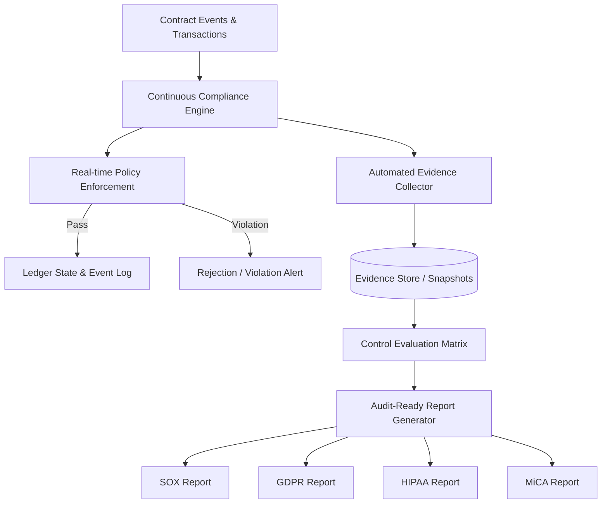

# Contract Event Audit and Compliance Automation

## Architecture Overview

AuditLedger's contract event audit and compliance automation layer provides real-time control monitoring, automated evidence collection, policy enforcement, and audit-ready reporting across **SOX**, **GDPR**, **HIPAA**, and **MiCA** regulatory standards.

## Continuous Control Monitoring

Controls across supported frameworks are continuously monitored against emitted contract events:
- **SOX (Sarbanes-Oxley)**: Section 404 internal controls, segregation of duties, change management immutability.
- **GDPR (EU 2016/679)**: Article 17 right-to-erasure crypto-shredding, Article 32 processing security, storage limitation.
- **HIPAA (Health Insurance Portability & Accountability Act)**: 45 CFR §164.312 audit controls, minimum necessary role enforcement, ePHI encryption verification.
- **MiCA (EU Markets in Crypto-Assets)**: Title III asset-referenced token reserve transparency, Title VI insider trading & market abuse anomaly monitoring.

## Automated Evidence Ingestion Pipeline

1. Contract events trigger compliance evaluation filters based on required event types.
2. Cryptographic evidence records are generated containing event hash, submitter identity, timestamp, and metadata.
3. Evidence records are matched to corresponding controls in the control matrix.
4. Weekly automated evidence snapshots are compiled and preserved for independent auditor examination.
