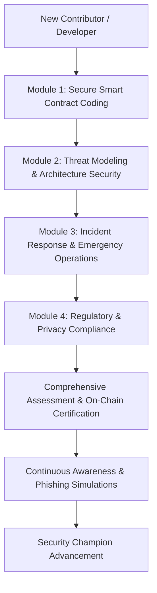

# Developer Security Training & Awareness Program

## Overview

The Developer Security Training & Awareness Program ensures all contributors and core developers building on the Decentralized Audit Ledger understand and adhere to enterprise-grade security practices, secure smart contract coding standards, threat modeling principles, incident response protocols, and regulatory compliance requirements.

This program directly satisfies compliance controls across:
- **SOC 2 Type II**: CC2.1 (Commitment to Integrity and Ethics), CC6.1 (Security Training & Access Controls)
- **ISO/IEC 27001:2022**: Control A.7.2.2 (Information Security Awareness, Education and Training)
- **MiCA**: Article 73 (Systems Resilience, Smart Contract Auditing & Developer Competence)
- **GDPR**: Article 25 (Data Protection by Design and by Default)

---

## Core Training Curriculum

The curriculum is structured across four foundational modules with mandatory certification renewal every 365 days.

### Module 1: Secure Smart Contract Coding (Soroban & Rust)
- **Duration**: 90 minutes
- **Topics**:
  - Rust memory safety in `no_std` environments and bounded execution.
  - Soroban SDK storage models: instance vs temporary vs persistent storage keys.
  - Preventing storage key collision vulnerabilities and namespace isolation.
  - Integer overflow/underflow invariants and checked arithmetic operations.
  - Explicit authorization patterns (`Address::require_auth`) and multisig policy enforcement.
  - Anti-reentrancy patterns and ledger timestamp drift protections.
- **Passing Threshold**: 85% on practical coding challenges and knowledge test.

### Module 2: Threat Modeling & Architecture Security
- **Duration**: 60 minutes
- **Topics**:
  - STRIDE methodology applied to decentralized ledger systems (Spoofing, Tampering, Repudiation, Information Disclosure, Denial of Service, Elevation of Privilege).
  - DREAD scoring for vulnerability severity assessment.
  - Cross-chain bridge attack surfaces, oracle manipulation risks, and sandwich attacks.
  - Cryptographic trust boundaries and client-side signature validation.
- **Passing Threshold**: 80%.

### Module 3: Incident Response & Emergency Operations
- **Duration**: 60 minutes
- **Topics**:
  - On-chain emergency response runbooks and contract circuit breakers (`pause` / `unpause`).
  - Key compromise handling, private key rotation, and multisig threshold governance.
  - Crypto-shredding and tamper-evident audit logging during an active incident.
  - Incident severity matrix (P1 Critical to P4 Low), escalation paths, and public disclosure timelines.
- **Passing Threshold**: 85%.

### Module 4: Regulatory & Privacy Compliance
- **Duration**: 45 minutes
- **Topics**:
  - Privacy by Design: Zero-Knowledge event proofs, hashing PII, and off-chain data handling.
  - GDPR Right-to-Erasure within immutable append-only ledgers via crypto-shredding metadata.
  - Export controls, sanctions screening compliance, and PEP identification.
  - Evidence collection, audit trails, and SOC2/ISO27001 control matrix obligations.
- **Passing Threshold**: 80%.

---

## Developer Onboarding & Compliance Gates

1. **Pre-Commit Gate**: Developers must achieve passing certification on Module 1 (Secure Smart Contract Coding) prior to receiving commit privileges to protected repositories.
2. **Pull Request Verification**: CI/CD workflows run `scripts/security-training/verify-developer-compliance.sh` on every pull request to ensure the author maintains active security certification.
3. **Annual Recertification**: Modules must be recompleted annually to reflect newly discovered attack vectors, updated SDK releases, and revised compliance controls.

---

## On-Chain Verification Engine

Certification results and program metrics are registered through the `SecurityTrainingProgram` Soroban contract module (`src/security_training.rs`).

### Key Functions
- `record_training_completion(developer, module_id, score, certificate_hash)`: Records completed module with cryptographic certificate hash and calculated expiry timestamp.
- `is_developer_compliant(developer)`: Evaluates whether a developer has active passing certificates for all mandatory modules.
- `get_program_metrics()`: Provides aggregated compliance percentage and training status for automated audit reports.
