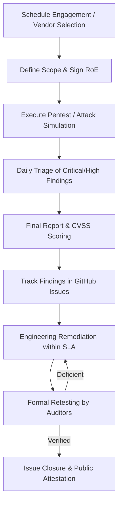

# Penetration Testing Program Policy

| Field | Value |
|-------|-------|
| **Document Version** | 1.0.0 |
| **Effective Date** | 2026-08-27 |
| **Program Owner** | Security Operations & Application Security |
| **Review Cadence** | Annual |

---

## 1. Program Objectives

The AuditLedger Continuous Penetration Testing Program ensures proactive identification and remediation of security vulnerabilities across on-chain smart contracts, off-chain relayers, APIs, and cloud infrastructure.

## 2. Program Scope & Asset Boundaries

### In-Scope Assets
- **Soroban Smart Contracts**: All contract functions, storage management, access control, upgrade mechanisms, and math operations.
- **REST, GraphQL & WebSocket APIs**: Authentication, rate limiting, data validation, serialization, CORS, and header security.
- **Cross-Chain Relayer & Bridge**: Merkle proof verification, EVM contracts, message queue integrity.
- **Infrastructure & Cloud**: Kubernetes cluster configurations, HashiCorp Vault integrations, cert-manager TLS, CI/CD pipelines.

### Out-of-Scope (Strictly Prohibited)
- Physical intrusion attacks against personnel or data centers.
- Social engineering, phishing, or vishing against employees or contributors.
- Direct volumetric Denial of Service (DDoS) against public Stellar validator nodes.
- Exfiltration or public disclosure of non-testnet user data.

## 3. Continuous Testing Methodology

AuditLedger employs a multi-layered testing strategy:
1. **Continuous Automated Dynamic Testing (DAST)**: Automated fuzzing, contract invariant fuzzers (`comprehensive_fuzz.rs`), and API security scanners run continuously in CI/CD.
2. **Periodic Gray-Box Engagements**: Conducted quarterly by internal and external specialists with authenticated roles.
3. **Annual Third-Party Comprehensive Audits**: In-depth white-box smart contract audits and red teaming exercises conducted by top-tier external security firms.

## 4. Program Governance Workflow

