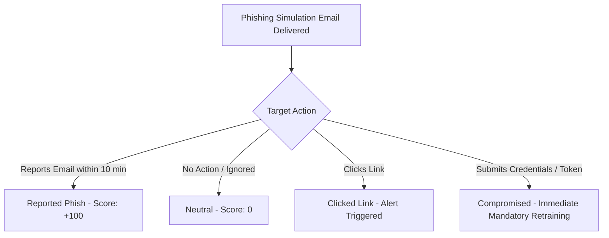

# Phishing Simulation & Social Engineering Awareness Guide

## Purpose

The Phishing Simulation Program evaluates and strengthens the organization's human layer defense against social engineering, targeted spear-phishing, credential theft, and malicious dependency supply-chain attacks.

---

## Campaign Framework & Schedule

- **Frequency**: Monthly randomized simulations across all developers, maintainers, and infrastructure operators.
- **Difficulty Progression**:
  - Baseline (Level 1): Generic IT security notifications or package update reminders.
  - Intermediate (Level 2): Spoofed Git forge pull request review requests, dependency security alerts.
  - Advanced (Level 3): Highly targeted spear-phishing mimicking key ecosystem partners, Soroban SDK emergency patches, or stellar wallet notices.

---

## Simulated Scenarios

| Scenario ID | Attack Vector | Simulation Theme | Red Flags to Identify |
|---|---|---|---|
| **PS-01** | Dependency Compromise | Emergency patch required for `soroban-sdk` | Lookalike domain (`soroban-sdks.org`), mismatched commit GPG signature |
| **PS-02** | Contributor Impersonation | Urgent security vulnerability PR review request | Suspicious fork repository URL, fake CI link requesting GitHub token |
| **PS-03** | Credential Harvesting | Expiring Docker Hub / Cargo registry API token | Non-official auth URL, unexpected SSO prompt |
| **PS-04** | Cloud Infra Alert | AWS / Kubernetes cluster unauthorized access alert | Generic greeting, non-standard domain, pressure to click immediate login link |

---

## Action Classification & Scoring

When a simulation is dispatched, participant responses are tracked:



1. **Reported Phish**: Target identifies and uses the report button / webhook within the SLA window. Positively weighted in developer security rating.
2. **Ignored**: Target ignores the email without reporting.
3. **Clicked Link**: Target clicks a simulated malicious payload URL. Triggers an in-browser educational micro-module explaining the missed indicators.
4. **Submitted Credentials / Tokens**: Target submits simulated credentials. Automatically triggers mandatory re-enrollment in Module 1 & Module 4 training.

---

## Metrics & KPIs

The program tracks the following metrics via `src/security_training.rs` and `scripts/security-training/simulate-phishing.py`:
- **Phish Reporting Rate (PRR)**: Target $\ge 85\%$ of simulations reported within 30 minutes.
- **Click-Through Rate (CTR)**: Target $< 3\%$ across all teams.
- **Credential Submission Rate (CSR)**: Target $0\%$.
- **Mean Time to Report (MTTR)**: Average time from email dispatch to first report. Target $< 15$ minutes.

---

## Automated Execution & Reporting

Campaigns are executed using:
```bash
python3 scripts/security-training/simulate-phishing.py --campaign-id 101 --targets-file .maintainers.json
```
Results are logged into the operational audit ledger and aggregated for SOC 2 evidence.
