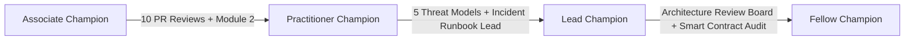

# Security Champion Program

## Charter & Objectives

The Security Champion Program embeds dedicated security advocates within each engineering squad to scale application security, lead threat modeling exercises, perform pre-review code audits, and bridge engineering with the core security & compliance team.

---

## Champion Tier Progression

### 1. Associate Champion
- **Prerequisites**: Completed all four developer security training modules.
- **Responsibilities**:
  - Perform preliminary security triage on incoming squad PRs.
  - Monitor automated CI/CD security scanning outputs (Trivy, cargo-deny, cargo-audit).
  - Advocate for secure defaults in squad planning sessions.

### 2. Practitioner Champion
- **Prerequisites**: 6 months active as Associate, completed $\ge 10$ verified PR security reviews.
- **Responsibilities**:
  - Lead feature-level threat modeling sessions (STRIDE/DREAD).
  - Assist squad in remediating identified static and dynamic analysis findings.
  - Review non-trivial cryptographic operations and authorization bindings.

### 3. Lead Champion
- **Prerequisites**: 1 year active, conducted $\ge 5$ comprehensive threat models, led incident response drills.
- **Responsibilities**:
  - Mentor new Associate and Practitioner champions.
  - Serve as security liaison during cross-team integrations (bridges, oracles, CBDC modules).
  - Participate in the Security Architecture Review Board (SARB).

### 4. Fellow Champion
- **Prerequisites**: Core maintainer status, recognized contributions to smart contract security tooling.
- **Responsibilities**:
  - Define organizational security policies and Soroban security standards.
  - Supervise external security audits and oversee major contract upgrades.

---

## On-Chain Governance & Activity Tracking

Security Champion appointments, tier promotions, and security activity verifications are tracked on-chain via `src/security_training.rs`:
- `appoint_security_champion(admin, champion, department, tier)`
- `promote_security_champion(admin, champion, new_tier)`
- `log_champion_activity(champion, activity_type)`
- `get_security_champion(champion)`
