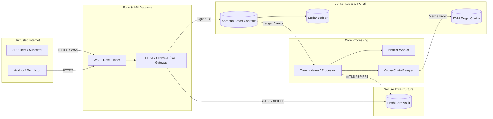

# Comprehensive STRIDE & PASTA Threat Model

| Field | Value |
|-------|-------|
| **Document Version** | 2.0.0 |
| **Last Quarterly Review** | 2026-08-27 |
| **Next Quarterly Review** | 2026-11-27 |
| **Methodologies** | STRIDE & PASTA (Process for Attack Simulation and Threat Analysis) |
| **Status** | Active / Baselined |

---

## 1. PASTA 7-Stage Analysis

### Stage 1: Definition of Objectives
- **Business Objectives**: Provide an immutable, tamper-evident audit ledger for enterprise and regulatory compliance without requiring blind trust in operators.
- **Security Objectives**:
  - Maintain absolute immutability of recorded historical events.
  - Enforce cryptographic non-repudiation on all submissions.
  - Guarantee data confidentiality for restricted regulatory categories.
  - Ensure 99.99% availability of event ingestion and querying services.
- **Compliance Objectives**: SOX 404, GDPR Art 17/32, HIPAA 164.312, MiCA Title III/VI.

### Stage 2: Definition of Technical Scope
The scope encompasses all architectural tiers of the AuditLedger ecosystem:
1. **On-Chain Soroban Contracts**: Event logging, hash-chain integrity, governance, data retention/erasure, compliance automation.
2. **Cross-Chain Bridge & Relayers**: Merkle inclusion proofs, EVM verifiers, cross-chain state synchronization.
3. **Off-Chain Ingestion & APIs**: REST API, GraphQL, WebSockets, WAF, distributed rate limiters.
4. **Notification & Indexer Subsystems**: Event dispatchers, webhook deliveries, queue workers.
5. **Infrastructure & Key Management**: Kubernetes clusters, HashiCorp Vault, KMS HSM keys, cert-manager TLS.

### Stage 3: Application Decomposition & Data Flow

### Stage 4: Threat Analysis (STRIDE per Component)

#### Component 1: Soroban Smart Contracts
| STRIDE Category | Threat ID | Threat Description | Likelihood | Impact | Initial Risk | Mitigations | Residual Risk |
|-----------------|-----------|--------------------|------------|--------|--------------|-------------|---------------|
| **Spoofing** | `THR-SC-01` | Unauthorized account submits governance transaction | Low | High | High | `require_auth()` enforced on all owner/multisig entrypoints; multi-party multisig threshold. | Low |
| **Tampering** | `THR-SC-02` | Attacker mutates logged event metadata | Very Low | Critical | High | Content-addressed SHA-256 event IDs; immutable append-only hash chains; immutable storage keys. | Very Low |
| **Repudiation** | `THR-SC-03` | Submitter denies submitting controversial audit event | Low | Medium | Medium | Cryptographic signature verification via Stellar transaction envelopes; submitter address stored on-chain. | Very Low |
| **Info Disclosure** | `THR-SC-04` | Confidential metadata leaked via public events | Medium | High | High | Metadata encryption required for sensitive categories; zero-knowledge commitments; crypto-shredding on erasure. | Low |
| **Denial of Service** | `THR-SC-05` | Event storage spam exhausting contract storage / caps | Medium | Medium | Medium | Configurable per-category event caps; transaction fee mechanisms; rate limits. | Low |
| **Elevation of Privilege** | `THR-SC-06` | Attacker bypasses role check in compliance or retention module | Low | Critical | High | Explicit role-based validation (`require_owner_or_multisig`, `require_compliance_officer`). | Very Low |

#### Component 2: Cross-Chain Bridge & Relayer
| STRIDE Category | Threat ID | Threat Description | Likelihood | Impact | Initial Risk | Mitigations | Residual Risk |
|-----------------|-----------|--------------------|------------|--------|--------------|-------------|---------------|
| **Spoofing** | `THR-BR-01` | Relayer injects fake cross-chain event proofs | Low | Critical | High | EVM contract verifies cryptographic Merkle inclusion proofs signed by Soroban state root. | Low |
| **Tampering** | `THR-BR-02` | Proof manipulation in transit | Low | Critical | High | Cryptographic hash verification of proof components on target chain. | Very Low |
| **Repudiation** | `THR-BR-03` | Relayer drops events without proof of delivery | Medium | Medium | Medium | On-chain acknowledgement tracking and relayer SLA monitoring. | Low |
| **Info Disclosure** | `THR-BR-04` | Bridge eavesdropping exposes proprietary audit events | Low | Medium | Medium | End-to-end payload encryption prior to cross-chain relaying. | Low |
| **Denial of Service** | `THR-BR-05` | Relayer RPC throttling / exhaustion | Medium | Medium | Medium | Clustered redundant relayers with automatic failover and backpressure queues. | Low |
| **Elevation of Privilege** | `THR-BR-06` | Unauthorized upgrade of EVM bridge contract | Very Low | Critical | High | Timelock governance contract requiring multi-sig consensus for contract upgrades. | Low |

#### Component 3: REST / GraphQL / WebSocket API Gateway
| STRIDE Category | Threat ID | Threat Description | Likelihood | Impact | Initial Risk | Mitigations | Residual Risk |
|-----------------|-----------|--------------------|------------|--------|--------------|-------------|---------------|
| **Spoofing** | `THR-API-01` | API key theft / spoofed client identity | Medium | High | High | Short-lived OAuth/OIDC JWT tokens, PKCE enforcement, API key rotation in Vault. | Low |
| **Tampering** | `THR-API-02` | Request parameter tampering (SQLi / NoSQLi / XSS) | Medium | High | High | Strict JSON schema / OpenAPI validation, parameterized queries, DOMPurify. | Very Low |
| **Repudiation** | `THR-API-03` | API access without logging | Low | Medium | Medium | Structured audit logging with correlation IDs sent to immutable log sink. | Very Low |
| **Info Disclosure** | `THR-API-04` | Verbose error stack traces exposing internal paths | Medium | Low | Medium | Production error sanitization middleware masking internal stack traces. | Very Low |
| **Denial of Service** | `THR-API-05` | Distributed Layer 7 HTTP flood / WebSocket connection exhaustion | High | High | High | Distributed Redis token bucket rate limiting, AWS Shield / Cloudflare WAF. | Low |
| **Elevation of Privilege** | `THR-API-06` | IDOR / Broken Object Level Authorization | Medium | High | High | Zero-Trust capability checks (`LeastPrivilegeAuthorizer`) and tenant boundary isolation. | Low |

### Stage 5: Vulnerability Analysis
- Continuous static analysis: `cargo-clippy`, `cargo-audit`, `eslint-security`, `trivy`.
- Fuzz testing: Comprehensive contract property tests and boundary fuzzer (`comprehensive_fuzz.rs`).
- Dependency vulnerability tracking: Dependabot + cargo-deny + OSV database.

### Stage 6: Attack Trees & Simulation Scenarios
1. **Scenario 1: Attacker attempts to modify historical compliance record**
   - Step 1: Attempt direct storage mutation -> Blocked by Soroban immutability.
   - Step 2: Attempt contract upgrade injection -> Blocked by multisig owner auth.
   - Step 3: Attempt hash-chain fork -> Blocked by deterministic sequential ledger index and SHA-256 chain verification.
   - *Outcome: Attack Prevented*.

2. **Scenario 2: Attacker compromises off-chain API node**
   - Step 1: Gain execution on API pod -> Blocked from Vault secrets by SPIFFE mTLS authorization policy.
   - Step 2: Attempt network lateral movement -> Blocked by Kubernetes default-deny NetworkPolicies.
   - Step 3: Forge signed Soroban transaction -> Blocked because private keys reside inside HSM/Vault, not on API pods.
   - *Outcome: Blast radius contained*.

### Stage 7: Risk & Impact Analysis
- All critical and high threats have active architectural and cryptographic mitigations.
- Total residual risk across all components is maintained within the **Low** acceptable threshold.
