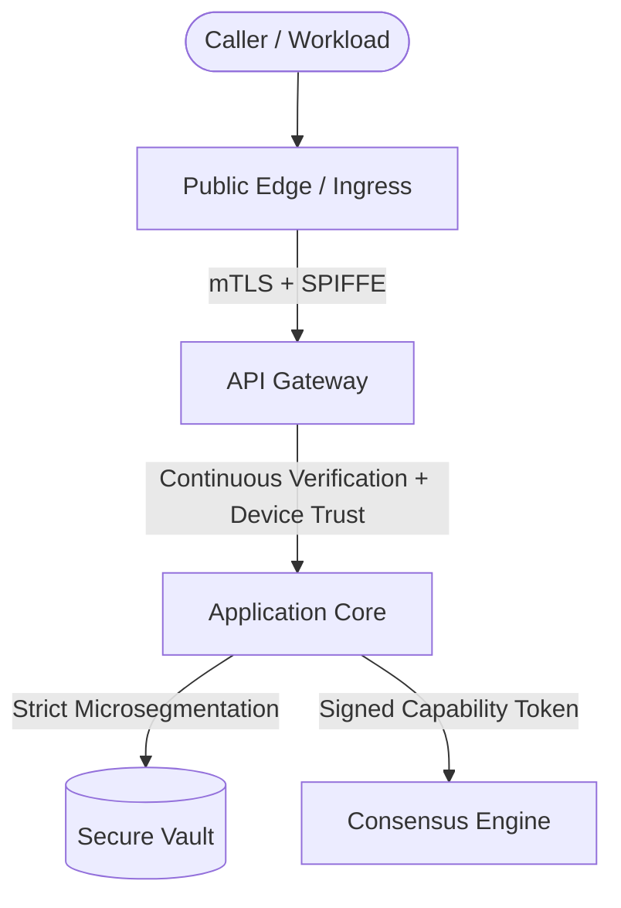

# Zero-Trust Architecture (ZTA)

## Overview

AuditLedger implements a multi-tier Zero-Trust Architecture (ZTA) adhering to NIST SP 800-207 principles:
1. **Identity-Based Access**: Every workload and actor must authenticate via cryptographic identities (SPIFFE/SPIRE IDs or Stellar public keys).
2. **Device Trust**: Dynamic evaluation of endpoint security posture (TPM/Secure Enclave attestation, OS version, disk encryption, EDR).
3. **Network Segmentation**: Strict microsegmentation across network boundaries with default-deny policies.
4. **Continuous Verification**: Real-time session risk monitoring and idle timeout re-evaluation instead of static perimeter trust.
5. **Least Privilege**: Fine-grained, scoped capability grants with automated expiration and step-up auth.

## Architectural Components

### 1. SPIFFE/SPIRE Workload Identity
- Workloads are issued short-lived X.509 SVIDs with SPIFFE identifiers (e.g. `spiffe://auditledger.org/ns/prod/sa/api-gateway`).
- Mutual TLS (mTLS) is enforced for all inter-service communications.

### 2. Device Trust Engine
Endpoints are scored (0–100) based on hardware attestation:
- Hardware TPM 2.0 / Secure Enclave: +30 pts
- Full Disk Encryption (LUKS/FileVault/BitLocker): +25 pts
- EDR Agent active & reporting: +25 pts
- Baseline OS integrity: +20 pts

### 3. Continuous Verification
Sessions are continuously assessed for anomaly markers, velocity anomalies, and token lifetime constraints. Any dynamic risk spike (>=80) instantly revokes the session.

### 4. Least-Privilege Capabilities
Privileges are granted as granular capabilities (e.g. `event:log`, `compliance:sweep`) with explicit expiration times rather than monolithic superuser roles.
