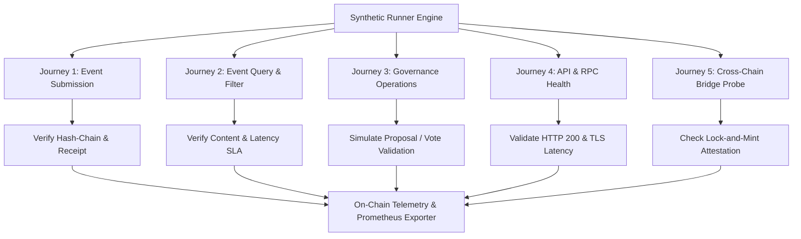

# Synthetic Monitoring & SLA Tracking Guide

## Overview

The Synthetic Monitoring subsystem provides proactive, continuous end-to-end verification of the Decentralized Audit Ledger's critical user journeys, API health, RPC nodes, and smart contract execution paths.

Rather than relying purely on passive telemetry (which only discovers errors when real users encounter them), synthetic probers inject deterministic, simulated transactions and queries across testnet and mainnet infrastructure on 30–60 second intervals.

---

## Critical User Journeys Monitored



### 1. Journey 1: Event Submission (`EventSubmission`)
- **Action**: Constructs a signed synthetic audit event with unique salt, submits transaction to Soroban contract, waits for inclusion block, and verifies cryptographic SHA-256 hash-chain linkage.
- **SLA Target**: 99.90% uptime, P95 latency $< 600\text{ ms}$, P99 latency $< 1500\text{ ms}$.

### 2. Journey 2: Event Query & Indexing (`EventQuery`)
- **Action**: Queries historical events by order index, category, and submitter address. Verifies pagination boundaries and validates payload integrity.
- **SLA Target**: 99.95% uptime, P95 latency $< 250\text{ ms}$, P99 latency $< 800\text{ ms}$.

### 3. Journey 3: Governance Operations (`GovernanceOperations`)
- **Action**: Tests proposal state query, threshold quorum calculation, and simulated vote submission.
- **SLA Target**: 99.90% uptime, P95 latency $< 1000\text{ ms}$.

### 4. Journey 4: API & RPC Node Health (`ApiHealthCheck`)
- **Action**: Checks health endpoints of Stellar Horizon, Soroban RPC, indexing nodes, and REST gateways.
- **SLA Target**: 99.99% uptime, P95 latency $< 150\text{ ms}$.

---

## Service Level Objectives (SLOs) & SLA Metrics

| Journey | Target Uptime | P95 Latency SLA | P99 Latency SLA | Evaluation Window |
|---|---|---|---|---|
| **Event Submission** | 99.90% (9990 bps) | 600 ms | 1500 ms | 24 Hours (Rolling) |
| **Event Query** | 99.95% (9995 bps) | 250 ms | 800 ms | 24 Hours (Rolling) |
| **Governance Operations** | 99.90% (9990 bps) | 1000 ms | 3000 ms | 24 Hours (Rolling) |
| **API / RPC Health** | 99.99% (9999 bps) | 150 ms | 400 ms | 24 Hours (Rolling) |

---

## Incident Management & Automatic Escalation

When consecutive probe failures reach $\ge 3$ or rolling uptime drops below the SLA threshold:
1. An on-chain incident is registered via `open_synthetic_incident`.
2. Prometheus alert `SyntheticEndpointConsecutiveFailures` fires immediately.
3. On-call engineering is paged via PagerDuty / alerting bridge.
4. Once health is restored, the incident is closed via `resolve_synthetic_incident`.

---

## Running Synthetic Probers

Execute continuous synthetic checks:
```bash
python3 scripts/synthetic-monitoring/synthetic-prober.py --rpc-url https://soroban-testnet.stellar.org --interval 30
```

Generate SLA verification report:
```bash
python3 scripts/synthetic-monitoring/generate-sla-report.py --window 24h
```
